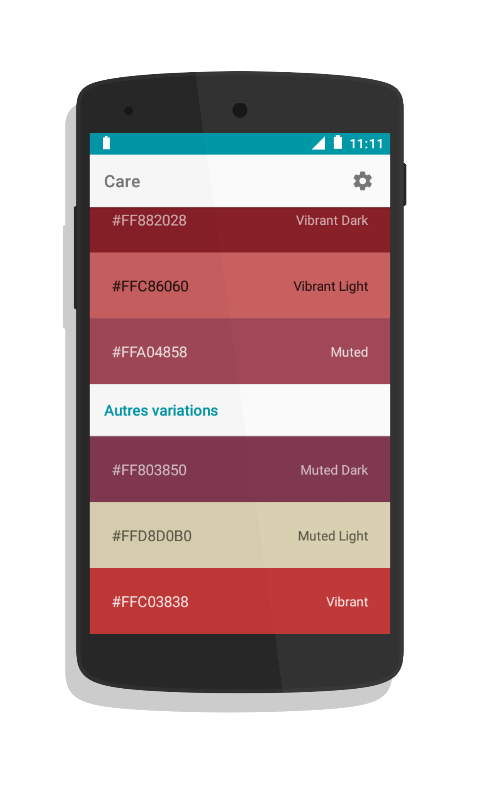

#Care


### Description
* Care allows you to have several color variations of your images from color palettes delivered by Google Dev
* Care is a utility for Developers and Designers

### Screenshots



# More
READ BEFORE CREATING A NEW BUG REPORT !

Take the time to check the problems you encountered with Care.

Bug reports will be ignored if they do not include the following information:
* Device name
* Version number of Care
* Android version name (including ROM Custom).

 # License

```
   Copyright 2017 MSay2

   Licensed under the Apache License, Version 2.0 (the "License");
   you may not use this file except in compliance with the License.
   You may obtain a copy of the License at

       http://www.apache.org/licenses/LICENSE-2.0

   Unless required by applicable law or agreed to in writing, software
   distributed under the License is distributed on an "AS IS" BASIS,
   WITHOUT WARRANTIES OR CONDITIONS OF ANY KIND, either express or implied.
   See the License for the specific language governing permissions and
   limitations under the License.
```
